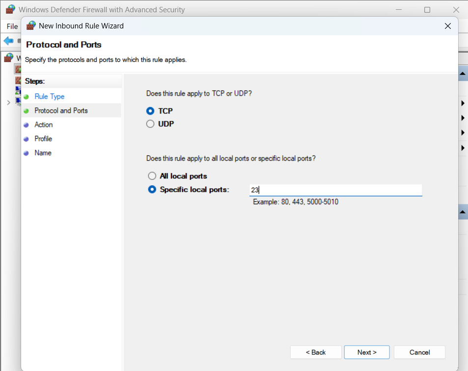
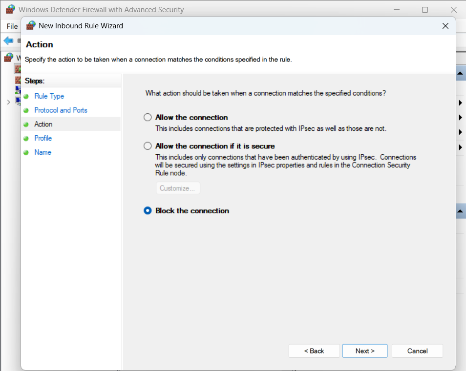
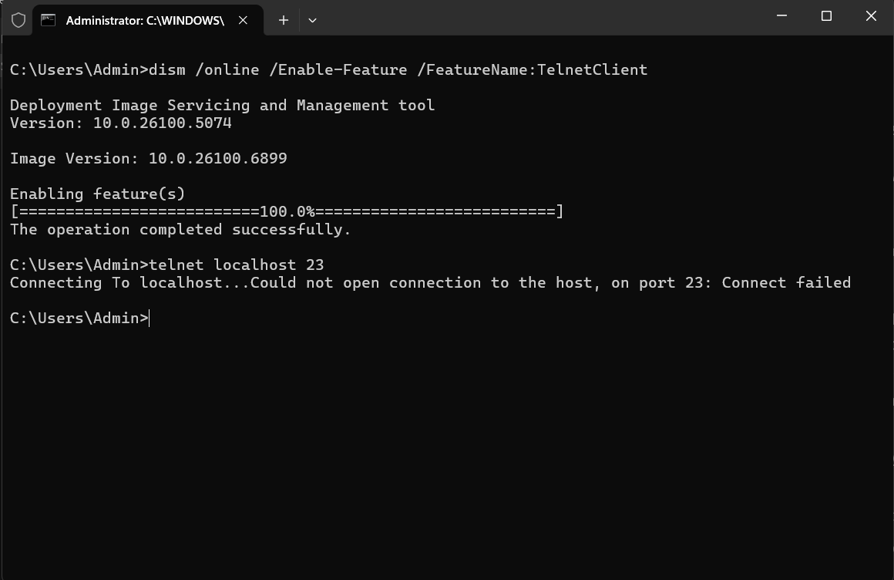

# Task 4: Setup and Use a Firewall on Windows

A repository for the task 04 from the Elevate labs, Cybersecurity

## Project Overview

This project demonstrates configuring and testing basic firewall rules on Windows using Windows Defender Firewall. The objective is to block inbound traffic to the Telnet port (23) and verify the rule using the built-in Telnet client.

---

## Objective

- Configure Windows Firewall to block inbound traffic on port 23 (Telnet)
- Test and document the results using the Telnet client

---

## Tools Used

- Windows Defender Firewall
- Command Prompt
- Telnet Client (`dism`-enabled)

---

## Step-by-Step Implementation

### 1. Enable the Telnet Client

To enable the Telnet client using the command line:

dism /online /Enable-Feature /FeatureName:TelnetClient

---

### 2. Create a Firewall Rule to Block Port 23

- Open Windows Defender Firewall with Advanced Security
- Add a new inbound rule for **TCP, specific local port 23**

_See screenshot:_

---

- Set action to **Block the connection**

_See screenshot:_

---

- Name the rule (e.g., "Telnet block") and finish setup

_See screenshot:_

---

### 3. Test the Rule Using Telnet

- Open Command Prompt and type:
telnet localhost 23
- **Result:** You should see “Could not open connection to the host, on port 23: Connect failed.”

_This test verifies that inbound Telnet (port 23) is blocked by the firewall._  
_See screenshot:_

---

## How Firewalls Work

Firewalls filter network traffic based on user-defined rules, allowing or blocking connections as required. This helps protect your computer by limiting exposure to untrusted networks and unauthorized access attempts.

---

## Deliverables

- Command and step documentation (see above)
- Screenshots:
- `test-firewall.png`
- `port-select.png`
- `block-connection.png`
- `rule.png`

---

## Learning Outcomes

- Learned to configure firewall rules on Windows
- Gained experience with Telnet for network testing
- Understood the practical impact of blocking/allowing ports using Windows Firewall
